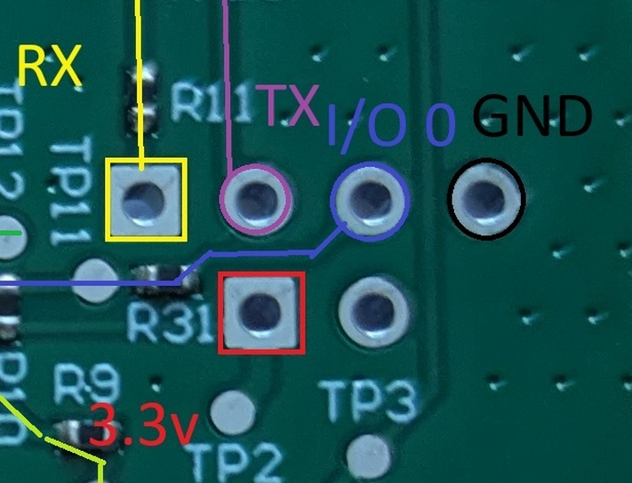
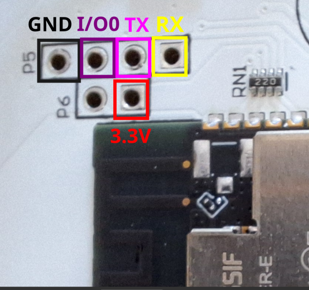

## Summary

This allows for the use of the Pura Mini, Pura 4, Pura Plus or Pura Wall V4
diffuser with Home Assistant via ESPhome. All Local control, no more cloud needed.

The two-bay models (Plus and Wall V4) read both cartridge bays
independently — the single ST25R3918 drives two single-ended antennas (RFO1 /
RFO2) and the driver alternates between them.

## Setup

1) Peel up the bottom of the silver back sticker and unscrew the two screws.
2) Connect to the 4x2 vias:
    * Your usb - serial converter's tx to pura's rx.
    * Your usb - serial converter's rx to pura's tx.
    * Your usb - serial converter's 3.3v to pura's 3.3v via
    * Your usb - serial converter's ground to pura's GND via.
    * Your usb - serial converter's ground to pura's I/O 0.
    
    For Pura Mini, it looks as below. For Pura 4 see the Pura 4 section.
    
3) Download the stock firmware with : "esptool --port COM whatever_com_port_it_is read-flash 0 ALL pura-mini-backup.bin"
4) Use ESPHome dashboard to perform the initial flashing. Once you can OTA update it, you can disconnect the serial converter.
5) Note the blanked api encryption key, ota password, and fallback wifi password. Be sure that is all set.
7) Use samba or something to upload the st25r3918 component directory to HA, in /homeassistant/esphome/components/  .
9) Install the yaml on the device and enjoy.

I am a bad programmer, this will burn down your house, don't blame me.

## Limitations
1) Scent names come from their website, so you will need to build a local database. If you know of more please add them here!
2) Pura says they have some fancy-pants tech that diffuses different scents differently. Shrug. All I do is turn the heat to 3 different levels.
3) Made up my own calculations for % left based on: "With a Pura Mini, a fragrance vial lasts about 30 days in a small space, diffusing 6–8 hours per day at medium intensity."
4) GPIO34 reads a divided down voltage but I didn't know what to do with that.
5) I can not find any connection that GPIO35 makes.
6) I am bad at programming.

   
Could not be done with the work of:
https://github.com/stm32duino/ST25R3916
and
https://github.com/stm32duino/ST25R3916

## Known Cart IDs

|   Cart ID | Name | Link |
| --------- | ---- | ---- |
|  E002080AA155AA6F | Lemon | https://pura.com/products/lemon |

## Pura Mini Layout
The esp32-wrover-e connects to a thermistor, ceramic heater, push button, 2 top leds, 1 button led, and a ST25R3918 NFC reader, which in turn connected to a Molex 14623605151 antenna.

esp32: https://documentation.espressif.com/esp32-wrover-e_esp32-wrover-ie_datasheet_en.html

ST25R3918: https://www.st.com/en/nfc/st25r3918.html A cut down STR253916.

Antenna: https://www.molex.com/en-us/products/part-detail/1462360151

Initial revision boards are white, Rev B boards are green. The only change seems
to be changing out the LNK3209G mosfet IC at U2 for the LNK3205D mosfet at U9
(and appropriate caps, etc)

| Pin | Mini Function |
| --- | -------- | 
| GPIO0| Held low for programming |
| GPIO1| TX for programming |
| GPIO3| RX for programming |
| GPIO4| Push button state |
|GPIO13| st25r3918 IRQ pin |
|GPIO14| st25r3918 i2c clock pin |
|GPIO15| LED near the push button |
|GPIO21| Heater |
|GPIO22| Top LEDS |
|GPIO27| st25r3918 i2c data pin|
|GPIO34| Voltage sensing? |
|GPIO35| Unknown |
|GPIO36| Thermistor |

## Pura 4

The larger Pura 4, with slots for 2 carts, has similar instructions but a different
layout. The pins for flashing are as shown. Once you have it working, you can
control the left and right carts independently in Home Assistant.

Use the pura-4.yaml file, and fill in config in a `secrets.yaml` file
following the examples in `secrets.yaml.example`

| Pin | Function |
| --- | -------- |
| GPIO0 | Held low for programming | 
| GPIO4 | Push button state |
| GPIO22| right heater |
| GPIO23| left heater |
| GPIO25| Top LEDs |
| GPIO26| NC |
| GPIO27| st25r3918 IRQ pin |
| GPIO32| st25r3918 i2c clock pin |
| GPIO33| st25r3918 i2c data pin |
| GPIO34| Board-revision voltage divider — one ADC read at boot identifies the model (see Pura Plus / Wall V4 sections) | 
| GPIO35| Unknown (shows connectivity on the upper light strip, but 25 is what you configure) | 
| GPIO36| right thermistor | 
| GPIO39| left thermistor |

### Pura 4 specific limitations

* The usage check doesn't really work since there are two cart slots
* The cart read only seems to work from the right slot

## Pura Plus

The tabletop Pura Plus is USB-C powered, with two cart bays, two WS2812
top LEDs, two capacitive buttons and a fan. Different board and pinout from the
Pura 4. Use `pura-plus.yaml`.

Both bays are read independently via the dual-bay NFC support (RFO1 / RFO2
antenna switching on the single ST25R3918). `GPIO34` — listed as unknown in the
Pura 4 notes above — is a board/model-revision voltage divider; one ADC read at
boot tells the firmware which model it is running on (observed ~0.81 V on the
Plus, ~0.14 V on the Wall V4).

| Pin | Function |
| --- | -------- |
| GPIO0  | Held low for programming |
| GPIO4  | right button |
| GPIO5  | st25r3918 i2c clock (SCL) |
| GPIO12 | left heater |
| GPIO13 | right heater |
| GPIO14 | fan |
| GPIO15 | left button |
| GPIO18 | st25r3918 i2c data (SDA) |
| GPIO21 | top LEDs (2x WS2812) |
| GPIO26 | accelerometer INT |
| GPIO27 | st25r3918 IRQ pin |
| GPIO34 | board-revision voltage divider (~0.81 V) |
| GPIO36 | left thermistor |
| GPIO39 | right thermistor |

## Pura Wall V4

A newer **mains-powered** wall unit that shares the Pura 4 pin family (heaters
22/23, thermistors 36/39, NFC I2C SDA33/SCL32 IRQ27), with a 6-LED WS2812 ring
on GPIO25 and two dual-bay pogo antennas. Use `pura-wall.yaml`.

**Safety:** the board is powered from the AC line through a *non-isolated*
LNK625DG off-line switcher, so its ground is not mains earth. Do **not** connect
a grounded USB-serial adapter while it is plugged into the wall. Do the first
flash from an isolated 3.3 V bench supply with the mains cord unplugged, then use
OTA afterwards. Treat the board as live.

| Pin | Function |
| --- | -------- |
| GPIO0  | Held low for programming |
| GPIO4  | button |
| GPIO22 | left heater |
| GPIO23 | right heater |
| GPIO25 | top LEDs (6x WS2812 ring) |
| GPIO27 | st25r3918 IRQ pin |
| GPIO32 | st25r3918 i2c clock (SCL) |
| GPIO33 | st25r3918 i2c data (SDA) |
| GPIO34 | board-revision voltage divider (~0.14 V) |
| GPIO36 | left thermistor |
| GPIO39 | right thermistor |

Support me here https://ko-fi.com/thefatbastid
